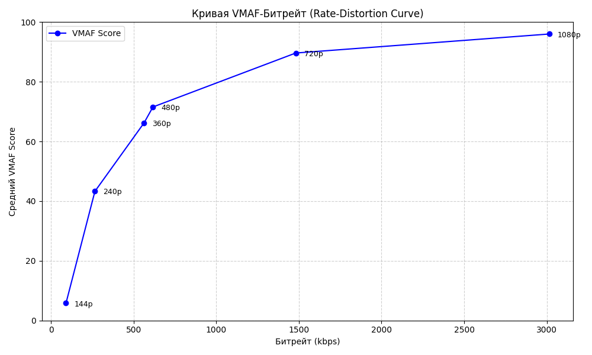

# Тестовое задание для вк
Все команды, использованные в задании, лежат в файлах *.sh 
Для вырезки первых 30 секунд и перефоматирования видео в соотвествующие разрешения был использоват скрипт `cut.sh`
Для подсчета статистики *VMAF* был использован файл `calculate.sh`
График был построен с помощью скрипта на питоне и библиотека matplotlib в файле `main.py`
## График

